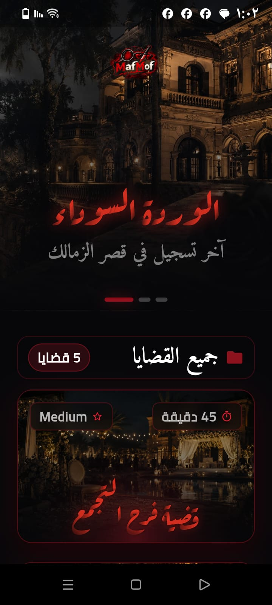
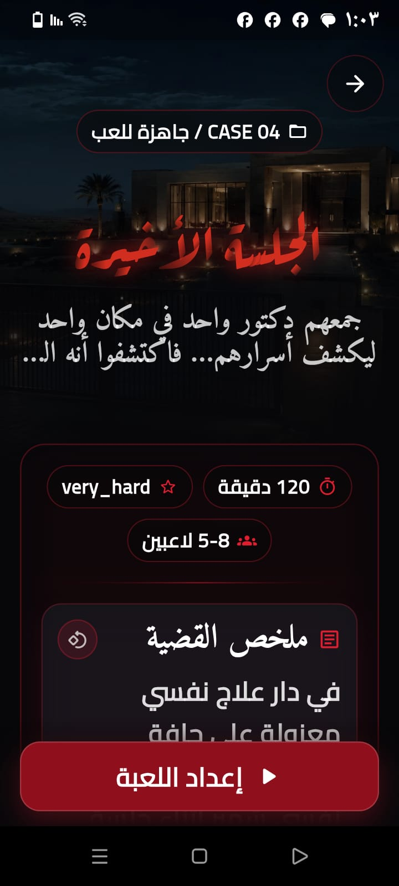
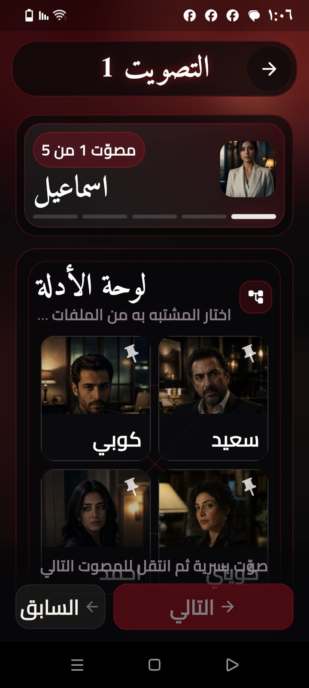

# 🎭 MafMof — Offline Arabic Social Deduction Game

<p align="center">
  
</p>

<p align="center">
  <strong>A host-led Arabic mystery party game built offline-first with Flutter, Drift, BLoC, and go_router.</strong>
</p>

<p align="center">
  
  
  
  
  
</p>

---

## 🚧 Project Status

This repository represents a polished public portfolio release of the **MafMof MVP**.

The current version includes **Case 01** with **5, 6, 7, and 8 player variants**. The app is Android-first, fully offline during gameplay, and includes a GitHub Release build for testing.

---

## 📚 Table of Contents

- [Overview](#-overview)
- [Why This Project](#-why-this-project)
- [Key Features](#-key-features)
- [Gameplay Flow](#-gameplay-flow)
- [Architecture](#️-architecture)
- [Offline-First Data Model](#️-offline-first-data-model)
- [Routing & Session Safety](#-routing--session-safety)
- [Testing Strategy](#-testing-strategy)
- [Screenshots](#-screenshots)
- [Demo & Release](#-demo--release)
- [Getting Started](#-getting-started)
- [Tech Stack](#-tech-stack)
- [Current Scope](#-current-scope)
- [Future Improvements](#-future-improvements)
- [License](#-license)
- [Author](#-author)

---

## 📖 Overview

**MafMof** is an offline-first Arabic social deduction game designed for host-led, in-person play sessions.

Inspired by classic mystery and social deduction party games, MafMof combines narrative-driven mystery cases with role-reveal mechanics, voting rounds, clue discovery, and final outcome reveals — all designed for Arabic-first gameplay and right-to-left user interfaces.

The app ships with **Case 01**, a complete mystery scenario supporting **5, 6, 7, and 8 player** configurations. Every role assignment, clue, voting round, and narrative reveal happens locally on the device — no internet connection, backend, or user accounts required during gameplay.

This project is an Android-first Flutter MVP focused on clean architecture, seeded local data, reliable session state, and a smooth host-controlled game experience.

---

## 🌟 Why This Project

This codebase was built to solve real problems that appear in offline party-game applications:

- **Role privacy during reveal**  
  Only the active player should see their role at the correct moment, reducing accidental reveals during shared-device gameplay.

- **Idempotent database seeding**  
  Game content such as cases, roles, clues, and player variants is seeded from bundled JSON into SQLite using safe replacement logic, making repeated setup and reinstall flows predictable.

- **Safe session handling**  
  Game state is managed locally with Cubits, repositories, and Drift-backed persistence to reduce state leaks between game runs.

- **Arabic-first / RTL experience**  
  Screens are designed Arabic-first with RTL directionality, Arabic typography, and long-text friendly layouts.

- **Offline-first gameplay**  
  The app does not depend on authentication, cloud sync, or a backend during gameplay, making it suitable for local in-person sessions.

- **Portfolio-ready architecture**  
  The project demonstrates Flutter clean architecture, Drift/SQLite, BLoC/Cubit state management, go_router navigation, dependency injection, and automated tests.

---

## ✨ Key Features

| Feature | Details |
|---|---|
| 🕵️ Mystery cases | Bundled Case 01 with roles, clues, and narrative flow |
| 👥 Player variants | 5, 6, 7, and 8 player configurations |
| 🎭 Role reveal | Private per-player role reveal flow |
| 🗳️ Voting rounds | Structured elimination voting flow |
| ⏱️ Game timer | Configurable phase timer for host-led sessions |
| 🔊 Sound effects | Optional SFX through a safe audio service wrapper |
| 🌙 Arabic-first / RTL | Right-to-left UI, Arabic typography, and long-text friendly layouts |
| 📴 100% offline gameplay | No internet dependency during the game session |
| 🗄️ Local database | Drift/SQLite seeded from bundled JSON assets |

---

## 🎮 Gameplay Flow

```text
App Launch
  └─► Home / Case Catalog
        └─► Case Details
              └─► Player Setup
                    └─► Role Assignment
                          └─► Private Role Reveal
                                └─► Game Stage
                                      ├─► Clue Reveal
                                      ├─► Voting Round
                                      └─► Final Reveal
```

The **host** controls the game flow through the app. Players pass the device during private role reveal, while the host manages stages, clues, voting, and final reveal.

All gameplay state is handled locally using Drift, repositories, and BLoC/Cubit streams.

---

## 🏗️ Architecture

This project follows a **feature-first clean architecture** approach:

```text
lib/
├── app/
│   ├── app.dart               # Root app configuration
│   ├── router/                # go_router setup and route guards
│   ├── theme/                 # App theme, colors, typography
│   └── di/                    # get_it / injectable dependency setup
│
├── core/
│   ├── audio/                 # SafeAudioService
│   ├── constants/             # Shared constants
│   ├── database/              # Drift database, DAOs, seed logic
│   ├── errors/                # Failure and error handling
│   ├── utils/                 # Shared utilities
│   └── widgets/               # Reusable UI widgets
│
└── features/
    └── game/
        ├── data/              # DTOs, repositories, data sources
        ├── domain/            # Entities, repository contracts, use cases
        └── presentation/      # Cubits, pages, widgets
```

### Key Architectural Decisions

| Area | Decision |
|---|---|
| Local storage | Drift/SQLite is used as the local source of truth |
| State management | BLoC/Cubit manages game session and UI state |
| Routing | go_router handles declarative navigation and route guards |
| Dependency injection | get_it and injectable organize services and repositories |
| Data flow | Repository pattern separates data, domain, and presentation layers |
| Content loading | JSON assets seed playable case data into the local database |

---

## 🗄️ Offline-First Data Model

Game content lives in bundled JSON files under:

```text
assets/data/cases/
├── case_01_5p.json
├── case_01_6p.json
├── case_01_7p.json
└── case_01_8p.json
```

On app startup, the local database is seeded with the available case variants. The seed operation is designed to be repeatable and safe for local development, reinstall flows, and future content updates.

The Drift schema covers the core gameplay entities:

| Table | Purpose |
|---|---|
| `cases` | Case metadata and narrative setup |
| `roles` | Role definitions for each case/player variant |
| `clues` | Ordered clue content |
| `sessions` | Active game session state |
| `session_players` | Player-to-role assignments for each session |

---

## 🧭 Routing & Session Safety

Navigation is handled with `go_router`.

The routing layer is designed to prevent invalid gameplay states, such as:

- Opening a game stage without an active session
- Reaching a private reveal screen at the wrong phase
- Carrying stale session data into a new game
- Returning to unsafe states after app restart or navigation changes

This keeps shared-device gameplay safer and reduces accidental role or clue exposure.

---

## 🧪 Testing Strategy

The project includes tests across routing, local data, Cubits, repositories, screens, and game assets.

```text
test/
├── app/router/        # Route guard and navigation behavior tests
├── core/              # Database seed and DAO tests
├── features/game/     # Cubit, repository, use case, and UI tests
└── support/           # Test helpers and mock factories
```

Run all tests:

```bash
flutter test
```

Run tests with expanded output:

```bash
flutter test --reporter expanded
```

---

## 📸 Screenshots

| Screen | Preview |
|---|---|
| Home / Case Catalog |  |
| Case Details |  |
| Player Setup |  |
| Role Reveal — Arabic |  |
| Game Stage / Timer |  |
| Voting Round |  |
| Final Reveal |  |

> Screenshots are captured from the Arabic Android version of the app and stored in the `screenshots/` folder.

---

## 🎬 Demo & Release

The latest Android APK build is available from the GitHub Releases page.

- 📦 **Latest Release:** [View latest release](https://github.com/esmael-mohsen/mafmof-offline-mystery-game/releases/latest)
- 📱 **Platform:** Android
- 📴 **Runtime:** Fully offline after installation
- 🌙 **Language:** Arabic-first / RTL

### Run Locally

You can also run the project locally using the setup steps below.

---

## 🚀 Getting Started

### Prerequisites

- Flutter SDK `3.x`
- Dart SDK `3.x`
- Android Studio or VS Code with Flutter extension
- Android emulator or physical Android device

### Setup

```bash
# 1. Clone the repository
git clone https://github.com/esmael-mohsen/mafmof-offline-mystery-game.git

# 2. Open the project
cd mafmof-offline-mystery-game

# 3. Install dependencies
flutter pub get

# 4. Generate required code
dart run build_runner build --delete-conflicting-outputs

# 5. Run the app
flutter run
```

### Verify Code Quality

```bash
dart run build_runner build --delete-conflicting-outputs
flutter analyze
flutter test
```

### Build APK

```bash
flutter build apk --release
```

---

## 📦 Tech Stack

| Layer | Technology |
|---|---|
| Framework | Flutter / Dart |
| State management | flutter_bloc / Cubit |
| Local database | Drift / SQLite |
| Navigation | go_router |
| Dependency injection | get_it / injectable |
| JSON serialization | json_serializable |
| Audio | audioplayers with SafeAudioService wrapper |
| Code generation | build_runner, drift_dev, injectable_generator |
| Typography | Cairo, Amiri, Aref Ruqaa Ink, Manrope, Cormorant Garamond |
| CI | GitHub Actions |

---

## ✅ Current Scope

- Case 01 is included as the first playable mystery case.
- The app supports 5, 6, 7, and 8 player variants.
- Gameplay is fully offline and local-device based.
- The current public release focuses on Android.
- The project is prepared as a Flutter portfolio case study.
- Android APK builds are available from GitHub Releases.

---

## 🚫 Not Included Yet

- Online multiplayer
- User accounts
- Cloud sync
- In-app purchases
- Custom case editor
- Gameplay demo video
- English localization

---

## 🔮 Future Improvements

- [ ] Add more playable cases with different role configurations
- [ ] Add a replay or spectator mode for the host
- [ ] Add animated role card transitions
- [ ] Add English localization for wider accessibility
- [ ] Add a custom case content management screen
- [ ] Add tablet-optimized layouts
- [ ] Publish a short gameplay demo video

---

## 📄 License

This project is licensed under the [MIT License](LICENSE).

Audio assets are sourced from OpenGameArt under CC0 and CC-BY 3.0 licenses.  
See [`docs/audio_licenses.md`](docs/audio_licenses.md) for attribution details.

---

## 👤 Author

**Esmael Mohsen**

- GitHub: [@esmael-mohsen](https://github.com/esmael-mohsen)

---

<p align="center">
  Built with Flutter · Offline-first · Arabic-first · Host-led gameplay
</p>
